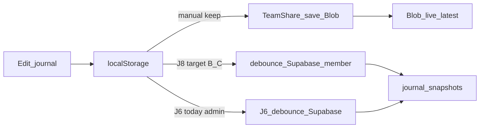

# J8 — Journal Supabase 자동 업로드 설계

> **상태:** J8-0 설계 문서 (2026-07-13)  
> **범위:** `MANUAL_MIRROR` 환경에서 일지 로컬 persist 후 **Supabase debounce 자동 upsert** (B/C 포함).  
> **비범위 (리뷰 고정):** Blob `autoSyncCloud` · **자동 pull/merge** · localStorage 제거 · improve-projects/ledger Blob 자동.

관련: [[j7-journal-realtime-blob-plan]] · [[journal-supabase-sync-plan]] · [[operations-backlog]] · [[supabase-phase0-runbook]] · [[obsidian-graph-poc]] · [[sot-map]]

([j7-journal-realtime-blob-plan.md](./j7-journal-realtime-blob-plan.md) · [journal-supabase-sync-plan.md](./journal-supabase-sync-plan.md) · [operations-backlog.md](./operations-backlog.md) · [supabase-phase0-runbook.md](./supabase-phase0-runbook.md))

---

## 0. 리뷰용 전제 (합의)

| 항목 | 결정 |
|------|------|
| Blob | 「팀 공유 저장/가져오기」 **수동 유지**. Hobby 연산 한도·suspend 재발 방지 (`autoSyncCloud=false`) |
| Supabase | 작성 → localStorage 즉시 + **~8s debounce 자동 upsert** |
| 가져오기 | **수동 유지** (J5 / 「팀 공유본 가져오기」 / 「원격 갱신됨」 배지 CTA). 자동 pull은 후속(가칭 J8-pull) |
| 롤아웃 | **Preview 파일럿(J8a)** → 안정 후 **Production `MANUAL_MIRROR` cutover(J8b, 별도 승인)** 와 함께 자동 경로 개방 |

J7은 팀 공유 SoT를 Supabase로 옮기는 트랙까지 완료했다. J8은 **수동 「팀 공유 저장」 클릭 부담**을 Supabase 쪽에서만 줄인다. Blob 자동은 쓰지 않는다.

---

## 1. 배경 · 동기

현재(Production `edu-team-tms-ten`):

1. 일지 편집 → **localStorage**에 즉시 저장
2. 팀/다른 PC 공유 → **「팀 공유 저장」**을 눌러야 클라우드(운영=Blob)로 올라감

불편: 매번 클라우드 버튼을 눌러야 함.  
제약: Blob 자동 sync는 과거 Hobby **한도 100% → suspend** 원인이었고, 릴리즈에서 자동 pull/save를 제거한 이력이 있다.

따라서:

- Blob = 수동 유지
- 자동 = **Supabase only** (per-member row, 교차 RMW↓, 한도 모델이 Blob과 다름)

---

## 2. 현재 vs 목표

### Today

| 저장소 | 역할 |
|--------|------|
| localStorage | 편집 SoT (즉시) |
| Blob `journal/live-latest.json` | Production 팀 공유 SoT (수동) |
| Supabase `journal_snapshots` | Preview 팀 공유 SoT (`MANUAL_MIRROR`); Production은 off |

```
Edit → localStorage
         ├─ manual 「팀 공유 저장」 → Blob (Production) 또는 Supabase (Preview J7d)
         ├─ manual 「팀 공유본 가져오기」
         └─ Preview /admin only: J6 debounce → Supabase (리더)
```

### Goal (J8, `MANUAL_MIRROR=true`일 때)

| 저장소 | 역할 |
|--------|------|
| localStorage | 계속 즉시 편집면 |
| Supabase `journal_snapshots` | 팀 공유 SoT + **편집 후 자동 upsert** |
| Blob | 수동 fallback / 재해 복구 (자동 POST 없음) |



---

## 3. Gate · 대상

### 재사용

| 위치 | 역할 |
|------|------|
| [`src/constants/supabaseSync.js`](../src/constants/supabaseSync.js) | `SUPABASE_MANUAL_MIRROR_ENABLED`, `JOURNAL_SUPABASE_AUTO_MIRROR_DEBOUNCE_MS` (8000) |
| [`src/hooks/useWeeklyJournal.js`](../src/hooks/useWeeklyJournal.js) | `autoMirrorSupabase` → `pendingSupabaseMembers` → debounce upsert |
| [`api/journal-snapshots.js`](../api/journal-snapshots.js) | member/admin POST, empty/conflict 가드, J7e `sync_events` |
| [`src/context/JournalProvider.jsx`](../src/context/JournalProvider.jsx) | `saveMemberToCloud` / Supabase 경로 |

### Today gate ([`src/App.jsx`](../src/App.jsx))

```text
autoMirrorSupabase =
  SUPABASE_MANUAL_MIRROR_ENABLED &&
  teamAccess.isLeader &&
  !teamAccess.isMemberScope &&
  !isViewer
```

→ Preview **리더 `/admin`만** J6 자동 미러.

### J8 목표 gate

```text
autoMirrorSupabase =
  SUPABASE_MANUAL_MIRROR_ENABLED &&
  !readOnly &&
  !isViewer &&
  (본인 슬라이스를 편집 중인 구성원 스코프
   || 리더 /admin 기존 J6)
```

- **B/C** (`/wschoi`, `/hyshin` 등): 본인 탭 편집 시 해당 `member_code`만 pending
- **리더 `/admin`:** 기존 J6 유지 (선택 구성원 슬라이스)
- **`autoSyncCloud`:** 계속 `false` (MUST)

구현 세부(J8a): `App.jsx`에서 member scope일 때 `autoMirrorSupabase`를 켜고, mirror 콜백이 **본인 코드만** upsert하도록 제한. 타인 탭 조회만 하는 경우는 자동 업로드하지 않음.

---

## 4. 안전 규칙 (MUST)

1. **빈 일지**로 원격 덮어쓰기 금지 (기존 empty guard).
2. **원격이 더 최신**이면 자동 upsert 하지 않음 → `conflict` / 알림 (J6와 동일 정신). 사용자는 수동 가져오기 후 다시 편집.
3. upsert **실패해도 localStorage 유지**. UI: `queued` → `saving` → `saved` | `conflict` | `error`.
4. J7e **`sync_events` best-effort** 유지 (실패해도 journal 200).
5. Production cutover **전** (`MANUAL_MIRROR=false`): 자동 업로드 **동작하지 않음** (의도).
6. 자동 경로는 **Supabase만**. Blob POST를 debounce/자동으로 호출하지 않음.

---

## 5. UX

| 요소 | 동작 |
|------|------|
| 편집/저장 | 기존처럼 localStorage 즉시 |
| 자동 업로드 | ~8s 무입력(debounce) 후 Supabase; 연속 편집 시 타이머 리셋 |
| 상태 힌트 | `supabaseMirrorSaveStatus` 라벨을 **구성원 일지 상태 패널에도** 노출 (「Supabase 자동 미러 대기/중/완료/충돌/실패」) |
| 「팀 공유 저장」 | **수동 fallback 유지** — 즉시 푸시·자동 실패 시 재시도 |
| 「팀 공유본 가져오기」 | 변경 없음 (수동) |
| 「원격 갱신됨」 배지 | J7a/J7e 유지; **자동 merge 없음** |

카피 가이드: “이 브라우저에 먼저 저장되며, Preview(또는 cutover 후)에서는 잠시 후 Supabase에도 자동 반영됩니다. 팀 공유 저장 버튼은 즉시 올리기용입니다.”

---

## 6. 롤아웃 · 롤백

| 단계 | 내용 | 승인 |
|------|------|------|
| **J8-0** | 본 설계 문서 | — |
| **J8a** | Preview: B/C(+기존 admin) `autoMirrorSupabase` 확장 · UI 힌트 · 테스트 | 구현 PR |
| **J8b** | Production `VITE_SUPABASE_MANUAL_MIRROR_ENABLED=true` + 북마크/릴리즈 (팀 공유 SoT=Supabase, Blob POST demote) | **별도 명시 승인** |
| (후속) | 확인 후 pull / 자동 pull — 본 문서 비범위 | 별 설계 |

### 롤백

1. Preview: `MANUAL_MIRROR` off 또는 feature를 admin-only로 되돌림 → 자동 중지
2. Production 사고: `MANUAL_MIRROR=false` → 자동 중지, Blob 수동 팀 공유 복귀
3. localStorage는 항상 유지

J8b는 J7 Production cutover와 **동일 env**를 켠다. cutover 없이 Production 자동만 켜는 경로는 두지 않는다 (SoT가 Blob인데 Supabase만 자동이면 이원화 혼란).

---

## 7. 명시적 비범위

- Blob `autoSyncCloud=true` / Blob debounce 자동 POST
- 자동 pull · 자동 merge · Realtime websocket 필수화
- localStorage 제거
- improve-projects / ledger Blob 자동
- Production cutover를 J8a에 포함 (J8b·별도 승인)
- 매직링크 필수 로그인

---

## 8. 코드 앵커 (구현 시)

| Path | 변경 예상 (J8a) |
|------|-----------------|
| `src/App.jsx` | member scope에서도 `autoMirrorSupabase` |
| `src/context/JournalProvider.jsx` | mirror 콜백이 구성원·리더 모두 지원하는지 확인 |
| `src/hooks/useWeeklyJournal.js` | 기존 debounce 재사용; 본인-only pending 가드 보강 가능 |
| `src/pages/WeeklyJournalPage.jsx` | 구성원 UI에 auto-mirror 상태 힌트 |
| `src/constants/supabaseSync.js` | debounce ms 재사용 (변경 최소화) |
| `tests/*` | gate·debounce·empty/conflict·Blob auto off 회귀 |

API 스키마/GRANT 추가 없음 (J3·J7e 완료 전제).

---

## 9. 검증 체크리스트

### J8a (Preview)

- [ ] B URL에서 일지 편집 → ~8s 내 `journal_snapshots` 해당 `member_code` `updated_at` 갱신
- [ ] 동일 시점 `sync_events` (`source=journal`, `event_type=snapshot_updated`) row (best-effort)
- [ ] 빈 일지로는 자동 upsert 안 됨
- [ ] 원격이 더 최신이면 conflict/스킵, 로컬 유지
- [ ] 「팀 공유 저장」 수동 즉시 푸시 동작
- [ ] Blob `autoSyncCloud` 경로 호출 없음 (Network에 journal-snapshot POST 자동 폭주 없음)
- [ ] Production URL(`ten`)에서는 자동 미발생 (`MANUAL_MIRROR=false`)

### J8b (승인 후)

- [ ] Production env true + 재배포
- [ ] 북마크·릴리즈: 팀 공유 SoT=Supabase, Blob POST demote 안내
- [ ] B/C 일상 작성 후 자동 반영·수동 가져오기 회귀
- [ ] 롤백 절차 숙지 (`MANUAL_MIRROR=false`)

---

## 10. 다음 작업

1. **J8-0** 본 문서 리뷰·머지
2. **J8a** Preview 구현 PR (코드)
3. Preview 안정 관찰 후 **J8b** Production cutover **명시 승인** 시에만 진행
