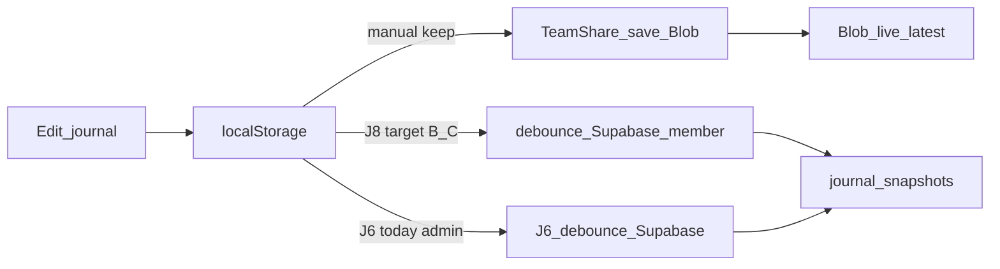

# J8 — Journal Supabase 자동 업로드 설계

> **상태:** J8b 적용(2026-09-22) → 롤백(2026-09-23) → 백필([#123](https://github.com/cxr542/edu-team-tms/pull/123)) · pull 로직 수정([#124](https://github.com/cxr542/edu-team-tms/pull/124), `mergeTeamSnapshotsPreferRicher`) · 오프라인+E2E 검증(2026-09-23, 실 Supabase 무변경) 완료 → **J8b 재승인 및 재적용(2026-09-23)**. J8-0 설계 문서(2026-07-13)에서 시작  
> **범위:** `MANUAL_MIRROR` 환경에서 일지 로컬 persist 후 **Supabase debounce 자동 upsert** (B/C 포함).  
> **비범위 (리뷰 고정):** Blob `autoSyncCloud` · **자동 pull/merge** · localStorage 제거 · improve-projects/ledger Blob 자동.

관련: [[j7-journal-realtime-blob-plan]] · [[journal-supabase-sync-plan]] · [[operations-backlog]] · [[supabase-phase0-runbook]] · [[obsidian-graph-poc]] · [[sot-map]]

([j7-journal-realtime-blob-plan.md](./j7-journal-realtime-blob-plan.md) · [journal-supabase-sync-plan.md](./journal-supabase-sync-plan.md) · [operations-backlog.md](./operations-backlog.md) · [supabase-phase0-runbook.md](./supabase-phase0-runbook.md))

---

## 0. 리뷰용 전제 (합의)

| 항목 | 결정 |
|------|------|
| Blob | 「팀 공유 저장/가져오기」 **수동 유지**. Hobby 연산 한도·suspend 재발 방지 (`autoSyncCloud=false`) |
| Supabase | 작성 → localStorage 즉시 + **~8s debounce 자동 upsert** |
| 가져오기 | **수동 유지** (J5 / 「팀 공유본 가져오기」 / 「원격 갱신됨」 배지 CTA). 자동 pull은 후속(가칭 J8-pull) |
| 롤아웃 | **Preview 파일럿(J8a)** → 안정 후 **Production `MANUAL_MIRROR` cutover(J8b, 별도 승인)** 와 함께 자동 경로 개방 |

J7은 팀 공유 SoT를 Supabase로 옮기는 트랙까지 완료했다. J8은 **수동 「팀 공유 저장」 클릭 부담**을 Supabase 쪽에서만 줄인다. Blob 자동은 쓰지 않는다.

---

## 1. 배경 · 동기

현재(Production `edu-team-tms-ten`):

1. 일지 편집 → **localStorage**에 즉시 저장
2. 팀/다른 PC 공유 → **「팀 공유 저장」**을 눌러야 클라우드(운영=Blob)로 올라감

불편: 매번 클라우드 버튼을 눌러야 함.  
제약: Blob 자동 sync는 과거 Hobby **한도 100% → suspend** 원인이었고, 릴리즈에서 자동 pull/save를 제거한 이력이 있다.

따라서:

- Blob = 수동 유지
- 자동 = **Supabase only** (per-member row, 교차 RMW↓, 한도 모델이 Blob과 다름)

---

## 2. 현재 vs 목표

### Today

| 저장소 | 역할 |
|--------|------|
| localStorage | 편집 SoT (즉시) |
| Blob `journal/live-latest.json` | Production 팀 공유 SoT (수동) |
| Supabase `journal_snapshots` | Preview 팀 공유 SoT (`MANUAL_MIRROR`); Production은 off |

```
Edit → localStorage
         ├─ manual 「팀 공유 저장」 → Blob (Production) 또는 Supabase (Preview J7d)
         ├─ manual 「팀 공유본 가져오기」
         └─ Preview /admin only: J6 debounce → Supabase (리더)
```

### Goal (J8, `MANUAL_MIRROR=true`일 때)

| 저장소 | 역할 |
|--------|------|
| localStorage | 계속 즉시 편집면 |
| Supabase `journal_snapshots` | 팀 공유 SoT + **편집 후 자동 upsert** |
| Blob | 수동 fallback / 재해 복구 (자동 POST 없음) |


```mermaid
flowchart LR
  edit[Edit_journal] --> local[localStorage]
  local -->|"manual keep"| blobBtn[TeamShare_save_Blob]
  local -->|"J6 today admin"| j6[J6_debounce_Supabase]
  local -->|"J8 target B_C"| j8[debounce_Supabase_member]
  j8 --> rows[journal_snapshots]
  j6 --> rows
  blobBtn --> blob[Blob_live_latest]
```

---

## 3. Gate · 대상

### 재사용

| 위치 | 역할 |
|------|------|
| [`src/constants/supabaseSync.js`](../src/constants/supabaseSync.js) | `SUPABASE_MANUAL_MIRROR_ENABLED`, `JOURNAL_SUPABASE_AUTO_MIRROR_DEBOUNCE_MS` (8000) |
| [`src/hooks/useWeeklyJournal.js`](../src/hooks/useWeeklyJournal.js) | `autoMirrorSupabase` → `pendingSupabaseMembers` → debounce upsert |
| [`api/journal-snapshots.js`](../api/journal-snapshots.js) | member/admin POST, empty/conflict 가드, J7e `sync_events` |
| [`src/context/JournalProvider.jsx`](../src/context/JournalProvider.jsx) | `saveMemberToCloud` / Supabase 경로 |

### Today gate ([`src/App.jsx`](../src/App.jsx))

```text
autoMirrorSupabase =
  SUPABASE_MANUAL_MIRROR_ENABLED &&
  teamAccess.isLeader &&
  !teamAccess.isMemberScope &&
  !isViewer
```

→ Preview **리더 `/admin`만** J6 자동 미러.

### J8 목표 gate

```text
autoMirrorSupabase =
  SUPABASE_MANUAL_MIRROR_ENABLED &&
  !readOnly &&
  !isViewer &&
  (본인 슬라이스를 편집 중인 구성원 스코프
   || 리더 /admin 기존 J6)
```

- **B/C** (`/wschoi`, `/hyshin` 등): 본인 탭 편집 시 해당 `member_code`만 pending
- **리더 `/admin`:** 기존 J6 유지 (선택 구성원 슬라이스)
- **`autoSyncCloud`:** 계속 `false` (MUST)

구현 세부(J8a): `App.jsx`에서 member scope일 때 `autoMirrorSupabase`를 켜고, mirror 콜백이 **본인 코드만** upsert하도록 제한. 타인 탭 조회만 하는 경우는 자동 업로드하지 않음.

---

## 4. 안전 규칙 (MUST)

1. **빈 일지**로 원격 덮어쓰기 금지 (기존 empty guard).
2. **원격이 더 최신**이면 자동 upsert 하지 않음 → `conflict` / 알림 (J6와 동일 정신). 사용자는 수동 가져오기 후 다시 편집.
3. upsert **실패해도 localStorage 유지**. UI: `queued` → `saving` → `saved` | `conflict` | `error`.
4. J7e **`sync_events` best-effort** 유지 (실패해도 journal 200).
5. Production cutover **전** (`MANUAL_MIRROR=false`): 자동 업로드 **동작하지 않음** (의도).
6. 자동 경로는 **Supabase만**. Blob POST를 debounce/자동으로 호출하지 않음.

---

## 5. UX

| 요소 | 동작 |
|------|------|
| 편집/저장 | 기존처럼 localStorage 즉시 |
| 자동 업로드 | ~8s 무입력(debounce) 후 Supabase; 연속 편집 시 타이머 리셋 |
| 상태 힌트 | `supabaseMirrorSaveStatus` 라벨을 **구성원 일지 상태 패널에도** 노출 (「Supabase 자동 미러 대기/중/완료/충돌/실패」) |
| 「팀 공유 저장」 | **수동 fallback 유지** — 즉시 푸시·자동 실패 시 재시도 |
| 「팀 공유본 가져오기」 | 변경 없음 (수동) |
| 「원격 갱신됨」 배지 | J7a/J7e 유지; **자동 merge 없음** |

카피 가이드: “이 브라우저에 먼저 저장되며, Preview(또는 cutover 후)에서는 잠시 후 Supabase에도 자동 반영됩니다. 팀 공유 저장 버튼은 즉시 올리기용입니다.”

---

## 6. 롤아웃 · 롤백

| 단계 | 내용 | 승인 |
|------|------|------|
| **J8-0** | 본 설계 문서 | — |
| **J8a** | Preview: A/B/C(+기존 admin) `autoMirrorSupabase` 확장 · UI 힌트 · 테스트 | ✅ 구현 PR [#120](https://github.com/cxr542/edu-team-tms/pull/120) (2026-09-22) |
| **J8b** | Production `VITE_SUPABASE_MANUAL_MIRROR_ENABLED=true` + 북마크/릴리즈 (팀 공유 SoT=Supabase, Blob POST demote) | 적용(2026-09-22) → 롤백(2026-09-23) → 백필+pull 수정+검증 후 **재적용(2026-09-23)**. 사유·검증 내역은 아래 §9a·§9b. 북마크/릴리즈 팀 공지는 운영진 진행 필요 |
| (후속) | 확인 후 pull / 자동 pull — 본 문서 비범위 | 별 설계 |

### 롤백

1. Preview: `MANUAL_MIRROR` off 또는 feature를 admin-only로 되돌림 → 자동 중지
2. Production 사고: `MANUAL_MIRROR=false` → 자동 중지, Blob 수동 팀 공유 복귀
3. localStorage는 항상 유지

J8b는 J7 Production cutover와 **동일 env**를 켠다. cutover 없이 Production 자동만 켜는 경로는 두지 않는다 (SoT가 Blob인데 Supabase만 자동이면 이원화 혼란).

---

## 7. 명시적 비범위

- Blob `autoSyncCloud=true` / Blob debounce 자동 POST
- 자동 pull · 자동 merge · Realtime websocket 필수화
- localStorage 제거
- improve-projects / ledger Blob 자동
- Production cutover를 J8a에 포함 (J8b·별도 승인)
- 매직링크 필수 로그인

---

## 8. 코드 앵커 (구현 시)

| Path | 변경 예상 (J8a) |
|------|-----------------|
| `src/App.jsx` | member scope에서도 `autoMirrorSupabase` |
| `src/context/JournalProvider.jsx` | mirror 콜백이 구성원·리더 모두 지원하는지 확인 |
| `src/hooks/useWeeklyJournal.js` | 기존 debounce 재사용; 본인-only pending 가드 보강 가능 |
| `src/pages/WeeklyJournalPage.jsx` | 구성원 UI에 auto-mirror 상태 힌트 |
| `src/constants/supabaseSync.js` | debounce ms 재사용 (변경 최소화) |
| `tests/*` | gate·debounce·empty/conflict·Blob auto off 회귀 |

API 스키마/GRANT 추가 없음 (J3·J7e 완료 전제).

---

## 9. 검증 체크리스트

### J8a (Preview)

- [x] A URL에서 일지 편집 → ~8s 내 자동 미러 상태 힌트 「대기 → 저장 중 → 완료」 확인 (2026-09-22, 육안 확인). B/C는 미검증
- [ ] 동일 시점 `sync_events` (`source=journal`, `event_type=snapshot_updated`) row (best-effort)
- [ ] 빈 일지로는 자동 upsert 안 됨
- [ ] 원격이 더 최신이면 conflict/스킵, 로컬 유지
- [ ] 「팀 공유 저장」 수동 즉시 푸시 동작
- [ ] Blob `autoSyncCloud` 경로 호출 없음 (Network에 journal-snapshot POST 자동 폭주 없음)
- [ ] Production URL(`ten`)에서는 자동 미발생 (`MANUAL_MIRROR=false`)

### J8b (승인 후)

- [x] Production env true + 재배포 (2026-09-22 최초 적용 → 09-23 롤백 → §9b 검증 후 09-23 재적용)
- [ ] 북마크·릴리즈: 팀 공유 SoT=Supabase, Blob POST demote 안내 — 운영진 공지 필요
- [ ] B/C 일상 작성 후 자동 반영·수동 가져오기 회귀 — 재적용 후 실사용 관찰 필요
- [x] 롤백 절차 숙지 (`MANUAL_MIRROR=false`) — 실제로 §9a 사유로 2026-09-23 1차 실행함

### 9a. J8b 롤백 사유 (2026-09-23)

A가 `/yhkim?year=2026&month=9`에서 9월 일지 일부가 안 보인다고 보고, `/admin` 「저장소 비교」로 확인한 결과:

| 구성원 | Supabase tasks | Blob tasks |
|--------|-----------------|------------|
| A | 34 | 235 |
| B | 1 | 215 |
| C | 0 | 211 |

`journal_snapshots`는 J3~J7 기간 Preview 파일럿 때만 간헐적으로 쓰여서 실제 운영 히스토리(Blob)에 크게 못 미쳤다. `useWeeklyJournal.js`의 `pullFromCloud`(J7c 설계)는 `SUPABASE_MANUAL_MIRROR_ENABLED`가 true면 Supabase에 스냅샷이 하나라도 있으면 **Blob을 아예 확인하지 않고 Supabase를 그대로 채택**한다. Production에서 이 플래그를 켠 상태로 누군가 「팀 공유본 가져오기」를 눌렀다면, 얕은 Supabase 데이터로 로컬(및 이후 Blob)이 덮어써질 뻔했다 — 실제 클릭·유실 사례는 없었고, 사전에 발견해 막았다.

A의 로컬 브라우저에 9/1~9/21 데이터가 없었던 것 자체는 이 pull 위험과는 별개 원인으로 보이며(코드상 자동 pull 경로는 없음), 원인은 미확정인 채로 남아있다. Blob에는 A의 데이터가 온전히 있다.

**조치:** Vercel Production의 `VITE_SUPABASE_MANUAL_MIRROR_ENABLED` 항목 삭제 → 재배포. Preview 값은 그대로 유지, J8a Preview 동작은 계속 유효.

**재개 조건:** (1) `journal_snapshots`를 Blob 스냅샷 기준으로 백필하거나, (2) `pullFromCloud`가 Supabase/Blob 중 `updatedAt` 또는 데이터 크기가 더 큰 쪽을 고르도록 수정 — 둘 중 하나 없이는 J8b 재승인하지 않는다.

**(1) 백필 완료 (2026-09-23):** `GET /api/journal-snapshot`(Blob, referer 인증)로 A/B/C 전체 스냅샷을 읽어, 각 구성원 슬라이스를 그대로 `POST /api/journal-snapshots`(구성원 referer, `updatedAt`은 Blob의 `meta.memberUpdatedAt[code]`)로 Supabase에 덮어썼다. 검증 결과 A 117일/237개, B 115일/215개, C 100일/211개로 Blob과 완전히 일치. `writeSnapshotAtomically`의 staleness 체크(신규 `updatedAt` > 기존)를 그대로 통과시켜, 앱이 스스로 쓰는 경로와 동일한 검증을 거쳤다.

**(2) pull 로직 수정 완료 (2026-09-23, PR [#124](https://github.com/cxr542/edu-team-tms/pull/124)):** `journalCloudSnapshot.js`에 `mergeTeamSnapshotsPreferRicher` 추가. `pullFromCloud`가 `MANUAL_MIRROR` on일 때 Supabase·Blob을 둘 다 fetch해서 구성원별로 task 개수가 더 많은 쪽을 고르고(동률일 때만 `updatedAt`으로 tie-break), 그 결과를 로컬과 다시 병합한다. 단위테스트 4건(같은 개수-다른 시각, 다른 개수-updatedAt 무시, 한쪽만 비어있는 양방향, 구성원별 독립 선택) 전부 통과.

### 9b. 재검증 및 재승인 (2026-09-23)

pull 로직 수정 후, 재적용 전 두 단계로 검증했다.

1. **오프라인 검증:** 운영 Blob에서 실제로 읽어온 A의 전체 스냅샷(237개 task)과, 사고 상황을 그대로 흉내낸 가짜 스냅샷(1개 task, `updatedAt`은 방금 시각)을 `mergeTeamSnapshotsPreferRicher`에 직접 넣어, 얕은 쪽이 "더 최신"이어도 풍부한 Blob 쪽이 선택되는 걸 확인. 실제 서비스는 전혀 호출하지 않음.
2. **E2E 검증 (Preview, 운영 DB 무변경):** 코드 변경 없는 throwaway 브랜치로 새 Preview 배포를 띄우고(`MANUAL_MIRROR=true`가 켜진 유일한 환경), A 개인 URL에서 브라우저 `fetch`를 가로채 **Supabase team-read 응답만** 가짜(얕은 데이터)로 교체하고 Blob 요청은 실제 네트워크로 흘려보냈다. 「팀 공유본 가져오기 → 본인 것 포함해서 가져오기」를 실제로 클릭한 결과, 로컬 저장소에 Blob의 진짜 데이터(117일/237개, 9/23 실제 task 2건)가 반영되고 가짜 얕은 데이터는 버려짐을 확인. 실제 Supabase에는 어떤 요청도 나가지 않았다(가로채서 네트워크 자체가 안 나감).

**결론:** 백필로 두 저장소를 동일하게 맞추고, pull 로직을 구조적으로 고쳐서 이후에 다시 벌어져도 안전하다는 것까지 확인했다. **Production `VITE_SUPABASE_MANUAL_MIRROR_ENABLED=true`를 재적용(2026-09-23)** — Vercel Production 전용 env 항목 재추가 + 재배포.

---

## 10. 다음 작업

1. **J8-0** 본 문서 리뷰·머지
2. **J8a** Preview 구현 PR (코드)
3. Preview 안정 관찰 후 **J8b** Production cutover **명시 승인** 시에만 진행
